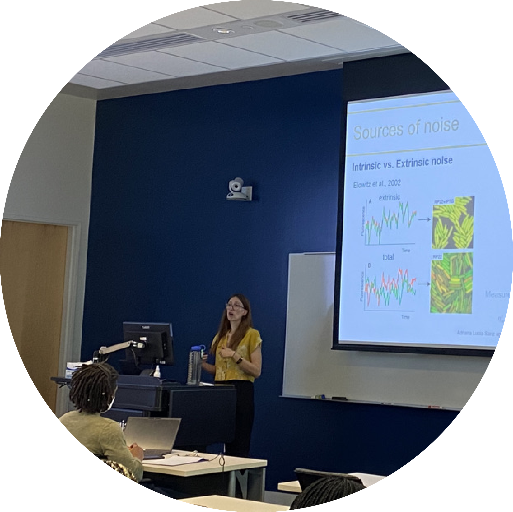

# Teaching

<!-- As part of a larger multi-scale course (credit to Joshua S. Weitz) I taught a module on understanding the structure and function of cells: including the molecular mechanisms governing mutation, gene expression and regulation, and evolution. During this module I taught how to analyze and model complex biological systems, emphazaising the stochasticity, and fluctuations inherent to biological systems. The teaching approach beyond lecturing, integrates hands-on tutorials, journal club discussions, problem solving exercises and final project development. Sudents acquire skills in the use of mathematical and computational tools, such as stability analysis of ode systems, memory-less stochastic models, ode integration and more. Overall, this module includes a broad range of analytical and problem-solving skills, which can be applied to many different fields within the biological sciences. -->

My priority as a teacher is to help students develop critical thinking skills by creating an active learning environment where everyone feels included stimulate student engagement and reinforcing integration of knowledge. I most recently taught a course on comprehending the organization and operation of cells, highlighting the inherent stochasticity and fluctuations of biological processes such as gene expression, regulation, mutation, and evolution.  Through a series of hands-on tutorials, journal club discussions, problem solving exercises sudents acquire skills in the use of mathematical and computational tools, such as: memory-less stochastic models, ode integration, stability analysis of ode systems, and more. Overall, this course includes a broad range of analytical and problem-solving skills, which can be applied to many different fields within the biological sciences.

<table class="center">
  <tr>
    <td>  </td>
    <td> </td>
  </tr>
    <tr>
    <td> <a href="https://www.ictp-saifr.org/qbioprogram/">Serrapilheira/ICTP-SAIFR Training Program</a> </td>
    <td> <a href="https://qbios.gatech.edu/quantitative-biosciences-hosts-hands-modeling-workshop">Quantitative Biosciences Hands-on Workshop</a> </td>
  </tr>
</table>

### Experience      
<table>
  <tr>
  <td style="color:#159957;"> 2021-2022
  </td>
    <td> <b>Instructor of record </b>  of Foundations in Quantitative Biosciences, Quantitative Biosciences graduate program at Georgia Institute of Technology
  </td>
  </tr>

  <tr>
  <td style="color:#159957;">
   Summer 2022
  </td>
    <td> <b>Instructor of record </b>Quantitative Foundations of Biological Concepts Serrapilheira/ICTP-SAIFR Training Program in Quantitative Biology and Ecology, Sao Paulo, Brazil.
  </td>
  </tr>

  <tr>
  <td style="color:#159957;">
   Spring 2021
  </td>
    <td> <b>Graduate teaching assistant</b> Fifth Annual Quantitative Biosciences Hands-on Workshop, Quantitative Biosciences graduate program at Georgia Tech.
  </td>
  </tr>
  
  <tr>
  <td style="color:#159957;">
2017-2018
  </td>
    <td> <b> Graduate teaching assistant</b> Department of Molecular Biology department at the Universidad Autonoma de Madrid
  </td>
  </tr>
  </table>

[back](./)
